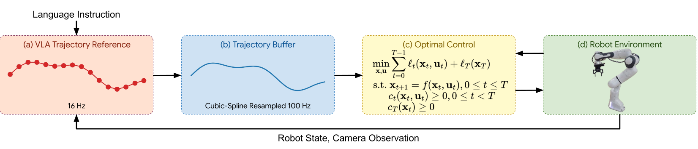
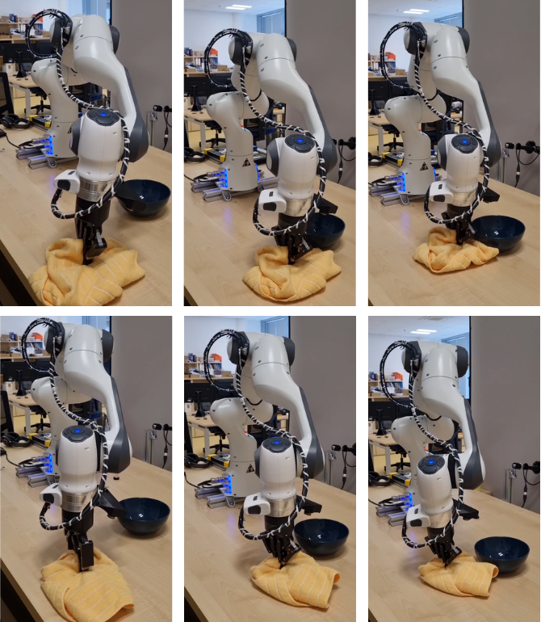
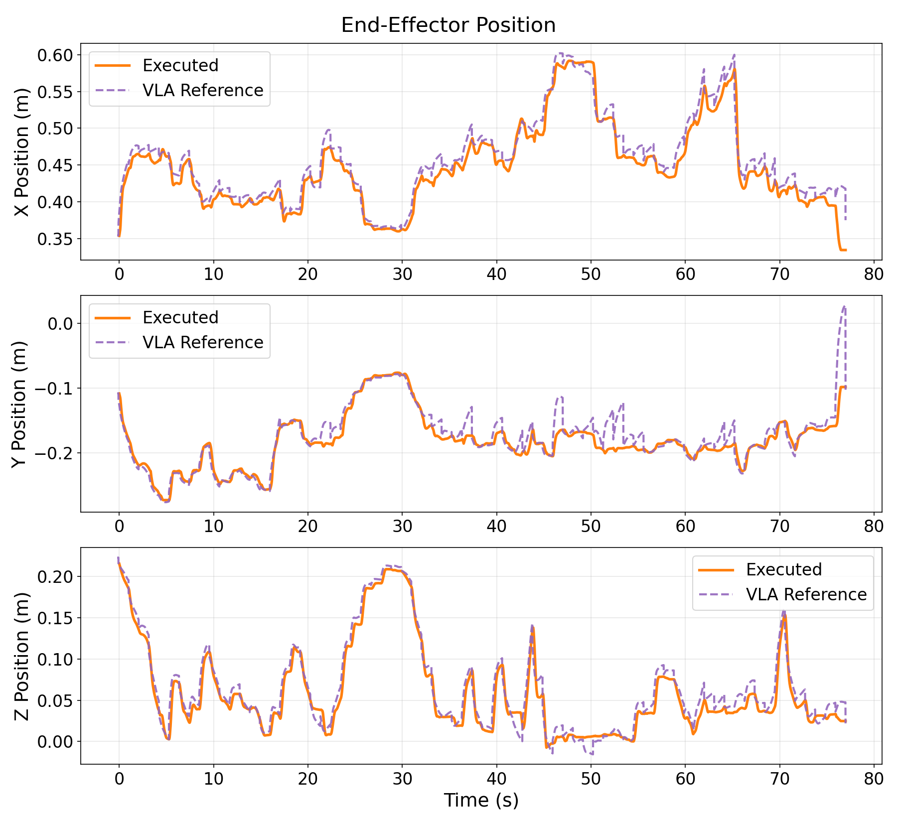
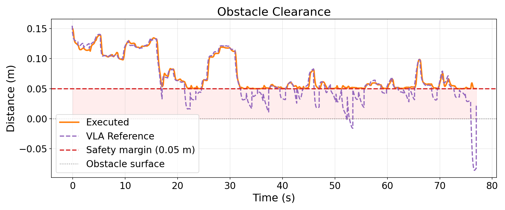

<div style="max-width:350px; margin:16px auto;">
  <video
    controls
    autoplay
    loop
    muted
    playsinline
    preload="metadata"
    style="width:100%; height:auto; border-radius:8px; box-shadow:0 2px 8px rgba(0,0,0,0.15); background:#000;"
  >
    <source src="{{ '/static/video_icra_workshop.mp4' | relative_url }}" type="video/mp4">
    Your browser does not support the video tag.
  </video>
</div>


# Abstract

Vision-Language-Action (VLA) models have recently shown impressive generalization on manipulation tasks, yet they provide no safety guarantees: they lack geometric awareness of the environment and have no explicit mechanism for collision avoidance, joint-limit handling, or safe physical interaction. While some deployment stacks address compliance through impedance control, this does not prevent constraint violations, a robot can still collide with an unknown obstacle, violate joint limits, or execute physically unsafe motions under an adversarial VLA output.
In this work, we propose a VLA-agnostic Model Predictive Control (MPC) layer that sits between any VLA and a torque-controlled manipulator, consuming high-level action references through a standardized ROS interface and enforcing hard collision-avoidance constraints at every timestep while retaining compliant behavior under unexpected contact.
We instantiate the framework with π<sub>0.5</sub> on a Franka Emika Panda and validate it on a real torque-controlled manipulator. To the best of our knowledge, this is the first integration of a generalist VLA with a torque-level MPC that enforces hard safety constraints, including collision avoidance, while retaining compliant behavior under unexpected contact.

# Method

Our architecture reconciles three components running at different rates: the VLA at f<sub>VLA</sub> = 2 Hz, the MPC at f<sub>MPC</sub> = 100 Hz, and the torque controller at f<sub>ctrl</sub> = 1 kHz. VLA action chunks are converted into a smooth state reference via a trajectory buffer that prepends the current robot configuration and fits a natural cubic spline through the waypoints. The MPC then solves a constrained finite-horizon optimal control problem at the torque level, enforcing whole-arm signed-distance collision constraints, joint limits, and torque limits, while a control-effort regularization term yields compliant behavior under unexpected contact.
<div style="text-align:center;">
  
  <p style="font-size:14px; color:gray; margin-top:5px;">
    Figure 1: System architecture. (a) Given a language instruction, the current robot state, and camera observations, the VLA emits action chunks over a standardized ROS topic. (b) The trajectory buffer fits a natural cubic spline through the waypoints and resamples it at 100 Hz to produce a smooth state reference. (c) The MPC solves a constrained OCP enforcing collision, joint, and torque limits while tracking the VLA intent. (d) The resulting torques are streamed to the low-level controller at 1 kHz.
  </p>
</div>


# Results 

We evaluate the system on a Franka Emika Panda torque-controlled manipulator driven by π<sub>0.5</sub>, on a table-wiping task where a bowl placed in the robot's workspace acts as an obstacle unseen during VLA training. We report two metrics from a representative episode: end-effector tracking of the VLA reference during nominal execution, and minimum clearance between the robot hand and the obstacle.
<div style="text-align:center;">
  
  <p style="font-size:14px; color:gray; margin-top:5px;">
    Figure 2: Table-wiping task with an obstacle unseen during VLA training. Top: Without MPC, the robot collides with the bowl. Bottom: With MPC-based replanning, the robot avoids the obstacle and successfully completes the wiping task.
  </p>
</div>

## End-effector tracking
The executed trajectory closely follows the VLA reference across all three Cartesian axes, confirming that the MPC layer introduces no significant motion distortion during nominal execution.
<div style="text-align:center;">
  
  <p style="font-size:14px; color:gray; margin-top:5px;">
    Figure 3: End-effector Cartesian position (X, Y, Z) during the cloth-wiping task with a spherical obstacle. The orange solid line shows the trajectory executed on the robot; the purple dashed line is the reference issued by the VLA policy.
  </p>
</div>

## Collision avoidance
The VLA reference repeatedly violates the 5 cm safety margin and even penetrates the obstacle surface (negative distance). The executed trajectory respects the constraint at every timestep, demonstrating that the MPC hard constraint actively corrects the policy output to maintain clearance, without interrupting task execution.
<div style="text-align:center;">
  
  <p style="font-size:14px; color:gray; margin-top:5px;">
    Figure 4: Minimum distance between the robot hand capsule and the spherical obstacle. The orange solid line shows the distance along the executed trajectory; the purple dashed line shows the distance that would have resulted from blindly following the VLA reference.
  </p>
</div>

# Citation

```bibtex
@article{haffemayer2026vla_mpc,
  title   = {From Vision-Language-Action to Torque: A Model Predictive
             Safety and Compliance Layer for Generalist Manipulation Policies},
  author  = {Haffemayer, Arthur and Ponimatkin, Georgy and
             Sedlacek, Martin and Sivic, Josef and Petrik, Vladimir},
  year    = {2026}
}
```